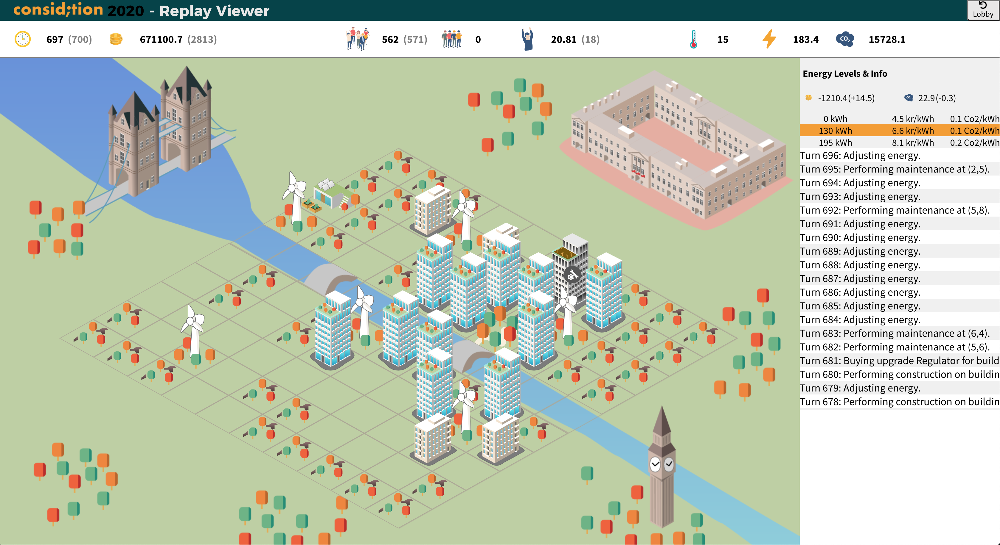

    

---

Considition 2020: a hackathon made possible by [Consid](https://consid.se/) and [Riksbyggen](https://www.riksbyggen.se/).

> This year's challenge was all about developing the smartest sustainable cities for our future - with smart algorithms.🏡 🌺 ⚡️ [https://www.considition.com](https://www.considition.com/rules)

The boilerplate was cloned from [here](https://github.com/Considition/2020-Python).

### Team: `git reset --hard origin HEAD` 💻
This was our team's attempt at solving the sustainable cities problem. Our final solution ended up placing in a 7th place out of roughly 50 teams. The hack was written using Python. 🐍

### Strategy and Solution ⚡️
The overall strategy was straight forward. A solution which prioritizes already existing buildings by maintaining and upgrading them, while always trying to keep the carbon footprint as low as possible. If there was nothing else to do we started to prioritize building new utilities and residence buildings at the most optimal locations. [See logic.py](/logic.py)

    

When deciding to build a new building a complex algorithm was being used to estimate the final score impact that particular building would have on the overall result to maximize the efficiency of the solution. That particular solution can be found on the branch `optimal_residence_utility_score` in the `logic.py` file, namely the functions:
- `residence_heuristic_score`
- `residence_heuristic_happiness`
- `residence_heuristic_co2`
- `utility_heuristic_score`

#### Discoveries 🔎
The team made two discoveries which significantly boosted our score:
- Rather than comparing the temperature difference in each building we started to compare the energy supplied.
- Instead of maintaining a building as soon as the health dropped below a certain hardcoded threshold we decided to only maintain the building when the health threshold was reached in combination with declining happiness. There was no need to maintain a building until the happiness was decreasing which significantly lowered our costs. This ultimately resulted in a higher final score.

### Difficulties During the Competition 🤔
The most diffiult task during the competition was to keep the emissions as low as possible to provide a more sustainable city but also to improve the final score.

Another difficult task was to write the algorithms to determine where to actually start building utilities and various residential buildings. A significant amount of time was spent trying to improve and finalize the algorithm. (See branch `optimal_residence_utility_score` and file `logic.py`)

### Results 🏅
The final score was calculated using the formula: `score = population*15 + happiness/10 - co2
`

| Map  | Score |
| ------------- | ------------- |
| Gothenburg  | 6619  |
| Kiruna  | 10406 |
| Visby | 9019|
| London (Test) | 21273 |
